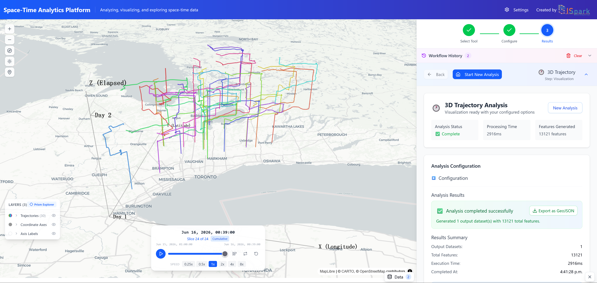
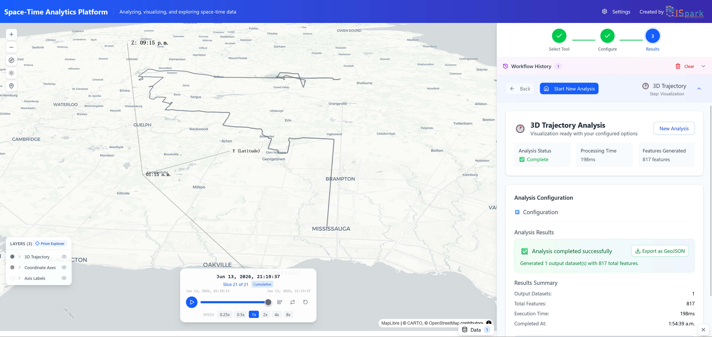
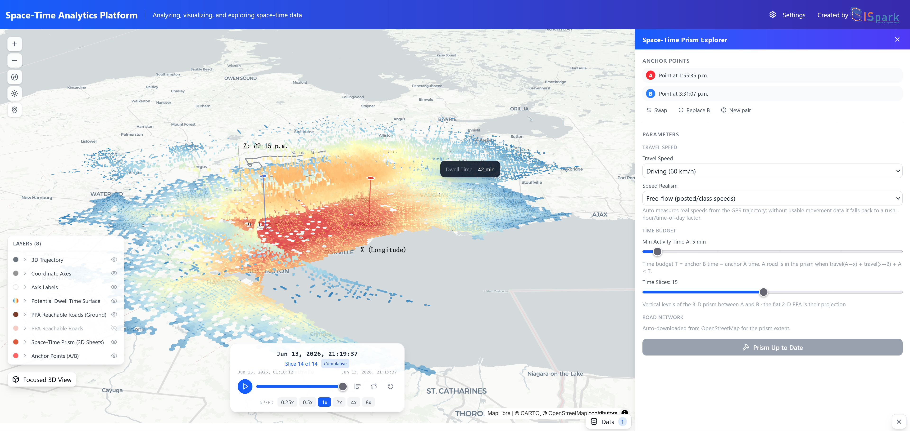
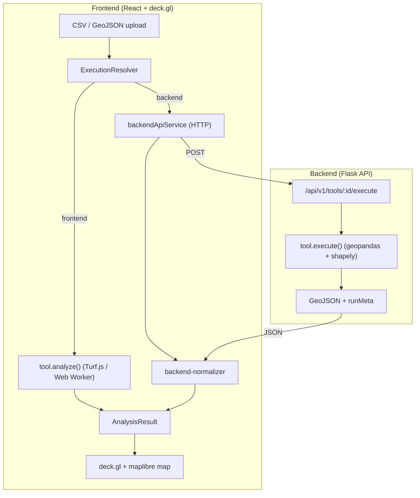

<div align="center">

# ChronoGeoLab

**An open toolkit for time‑geographic visualization, space‑time analysis, and mobility‑based exposure research.**

Upload trajectory data, run space‑time analyses in your browser, and explore the results on an interactive 3D map — no coding required.

[](https://wyzdevin.github.io/ChronoGeoLab/)
[](LICENSE)
[](https://github.com/WYZDevin/ChronoGeoLab/releases)
[](https://deck.gl/)

📖 [Documentation](https://wyzdevin.github.io/ChronoGeoLab/) · 🚀 [Getting Started](https://wyzdevin.github.io/ChronoGeoLab/guide/getting-started) · 🧭 [Tools](https://wyzdevin.github.io/ChronoGeoLab/tools/)



</div>

---

## What is ChronoGeoLab?

ChronoGeoLab turns raw movement data (GPS traces as **CSV** or **GeoJSON**) into
interpretable time‑geography visualizations. It's built for researchers, students,
and analysts studying human mobility, activity spaces, and environmental exposure:
bring a trajectory, pick a tool, and read the result on an interactive 3D map.

The app runs locally in your browser, backed by an optional Python service for
heavier server‑side computation. The recommended Docker setup starts both together
with a single command.

## Features

| Tool | What it shows |
|------|---------------|
| **3D Trajectory** | A person's path drawn as a 3D ribbon — space on the map, time rising along the vertical axis. |
| **Space‑Time Prism** | Everywhere someone *could* have been between two known stops, given a travel‑speed and time budget — the classic time‑geography "prism". |
| **Space‑Time KDE (STKDE)** | Activity hotspots in space *and* time, via space‑time kernel density estimation. |
| **Space‑Time Cube** | Trajectory points aggregated into 3D space‑time bins to reveal patterns. |

Also included: geometry helpers — **Buffer**, **Union**, and **Intersection** — for
shaping and combining study areas.

## Getting Started

The fastest way to run ChronoGeoLab is with Docker, which launches the map interface
and the analysis backend together.

### 1. Install Docker Desktop

Install [Docker Desktop](https://docs.docker.com/get-docker/) (Compose v2 included).
It's the only prerequisite for running the app.

> **Not comfortable with the command line?** You don't need it. The
> [Getting Started guide](https://wyzdevin.github.io/ChronoGeoLab/guide/getting-started)
> walks you through installing and running ChronoGeoLab entirely from the **Docker
> Desktop UI** (Option A — no terminal). Follow that, then jump to
> [Step 3](#3-run-your-first-analysis) below.

### 2. Start the app

From the project root:

```bash
docker compose up --build
```

When the build finishes, open **http://localhost:5173**. The backend runs on
`http://localhost:8000` and is wired up automatically. Stop everything with:

```bash
docker compose down
```

### 3. Run your first analysis

1. **Upload data.** Click **Upload** and choose a bundled sample —
   [`demo-datasets/individual/example_1.csv`](demo-datasets/individual/example_1.csv)
   (one real person's day, ~800 GPS points). ChronoGeoLab auto‑detects the
   longitude, latitude, altitude, and time columns, so there's nothing to map.
2. **Visualize the path.** Pick **3D Trajectory** and run it — the day's route
   rises into a 3D ribbon you can orbit, pan, and zoom.
3. **Build a Space‑Time Prism.** Select a home anchor and an end anchor, set a
   travel speed, and run it to see the reachable area between the two stops.

<div align="center">


</div>

📖 Full step‑by‑step walkthrough with screenshots: **[Getting Started →](https://wyzdevin.github.io/ChronoGeoLab/guide/getting-started)**

## Bring your own data

ChronoGeoLab reads **CSV** and **GeoJSON**. Only two fields are required; the rest
are optional and unlock more tools:

| Field | Required | Notes |
|-------|:--------:|-------|
| **Location** | ✅ | `longitude` + `latitude` columns (CSV) or a GeoJSON `Point`. `altitude` is used when present. |
| **Timestamp** | ✅ | Unix seconds or an ISO date‑time column. |
| User / trajectory ID | — | Keeps multiple people or tracks separate instead of merging them. |
| Stay / place label | — | Groups points by activity (home, work, a visit). |
| Environmental value | — | Exposure readings such as noise, pollution, or temperature. |

Columns are auto‑detected on upload. See
[Preparing Your Data](https://wyzdevin.github.io/ChronoGeoLab/guide/data-format) for
the full format reference, and [`demo-datasets/`](demo-datasets/) for more samples
(individual days and a 30‑user synthetic set).

## Run locally (development)

Requires **Node.js** (version pinned in `package.json`), **Python ≥ 3.12**, and
[**uv**](https://docs.astral.sh/uv/getting-started/installation/).

**Frontend**

```bash
cd app/front-end
cp ../../.env.example .env     # optional: set VITE_MAPBOX_API_KEY for the satellite basemap
npm install
npm run dev                    # Vite dev server → http://localhost:5173
```

**Backend** (optional — enables server‑side execution for heavier runs)

```bash
cd app/back-end
uv sync                                # install dependencies
uv run flask --app app run -p 8000     # start Flask → http://localhost:8000
uv run pytest tests/                   # run the test suite
```

The frontend detects the backend via `/api/v1/health` and enables server‑side
execution when it's available.

<details>
<summary><b>Architecture &amp; tech stack</b></summary>



| Layer | Technology |
|-------|-----------|
| UI | React 18 + TypeScript, Vite 6, Tailwind CSS 4, Radix UI / shadcn/ui |
| Map | deck.gl 9, react‑map‑gl 7, maplibre‑gl 4 |
| State | Redux Toolkit |
| Geospatial (browser) | Turf.js 7 |
| Backend | Flask 3, geopandas 1.x, Shapely 2, SciPy |
| Tooling (Python) | uv |

Full details: [Architecture reference](https://wyzdevin.github.io/ChronoGeoLab/reference/architecture)
· [API reference](https://wyzdevin.github.io/ChronoGeoLab/reference/api)
· [Deployment](https://wyzdevin.github.io/ChronoGeoLab/reference/deployment).
Deploying to Docker Hub is covered in [DEPLOY.md](DEPLOY.md).

</details>

## Documentation

The full documentation site lives at **[wyzdevin.github.io/ChronoGeoLab](https://wyzdevin.github.io/ChronoGeoLab/)** (source in [`docs/`](docs/)):

- [Getting Started](https://wyzdevin.github.io/ChronoGeoLab/guide/getting-started) — install and run your first analysis
- [Preparing Your Data](https://wyzdevin.github.io/ChronoGeoLab/guide/data-format) — supported formats and fields
- [Tools](https://wyzdevin.github.io/ChronoGeoLab/tools/) — each tool, its parameters, and the algorithm behind it
- [Architecture](https://wyzdevin.github.io/ChronoGeoLab/reference/architecture) & [API](https://wyzdevin.github.io/ChronoGeoLab/reference/api) — for developers
- [Contributing](https://wyzdevin.github.io/ChronoGeoLab/contributing/) — how to contribute, with or without an AI agent

## Contributing

Contributions are welcome — from humans and AI coding agents alike. Start with
[`CONTRIBUTING.md`](CONTRIBUTING.md) for setup, validation, and PR
expectations.

### Using AI for contribution

ChronoGeoLab follows the [AGENTS.md](https://agents.md) standard, so most
coding agents pick up the project rules automatically:

- **Codex, Cursor, Copilot coding agent, Jules, and most others** read
  [`AGENTS.md`](AGENTS.md) and the nested guides in
  [`app/front-end/`](app/front-end/AGENTS.md) and
  [`app/back-end/`](app/back-end/AGENTS.md) on their own — no setup needed.
- **Claude Code** reads `CLAUDE.md`, which imports `AGENTS.md`.
- **Any other agent** — start your session with:
  *"Read `AGENTS.md` and the nested `AGENTS.md` files before making changes."*

Each `AGENTS.md` is a table of contents: the hard rules up front, then
pointers to everything an agent needs — including the step-by-step playbook
for [adding or updating an analysis tool](https://wyzdevin.github.io/ChronoGeoLab/contributing/adding-a-tool).

You are responsible for what your agent produces: review the diff, run the
validation checks, and fill in the PR template honestly.

## Citation

If you use ChronoGeoLab in your research, teaching, publications, presentations, or
derivative software, please cite it (see [`CITATION.cff`](CITATION.cff)):

```bibtex
@software{wu_wang_2026_chronogeolab,
  author  = {Wu, Devin Yongzhao and Wang, Jue},
  title   = {ChronoGeoLab: An open toolkit for time-geographic visualization,
             space-time analysis, and mobility-based exposure research},
  version = {1.0.0},
  year    = {2026},
  note    = {Computer software},
  url     = {https://github.com/WYZDevin/ChronoGeoLab/}
}
```

## Credits & License

Developed by **[GISPark Lab](https://juewang.space/#GISPARKLAB)** — Devin Yongzhao Wu and Jue Wang.

Released under the [MIT License](LICENSE). Copyright © 2026 Devin Yongzhao Wu and Jue Wang.
