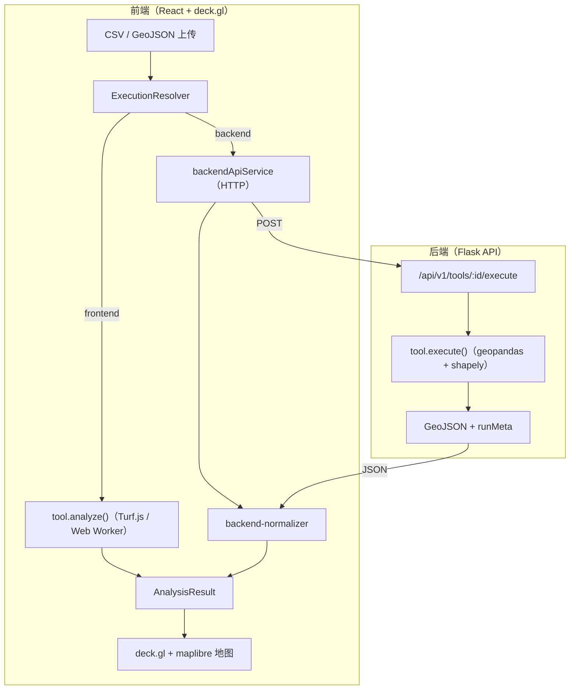

<div align="center">

# ChronoGeoLab

**一个面向时间地理学可视化、时空分析与基于移动性的暴露研究的开源工具箱。**

上传轨迹数据，在浏览器中运行时空分析，并在交互式 3D 地图上探索结果——无需编写任何代码。

[](https://wyzdevin.github.io/ChronoGeoLab/)
[](LICENSE)
[](https://github.com/WYZDevin/ChronoGeoLab/releases)
[](https://deck.gl/)

📖 [文档](https://wyzdevin.github.io/ChronoGeoLab/) · 🚀 [快速上手](https://wyzdevin.github.io/ChronoGeoLab/guide/getting-started.zh) · 🧭 [分析工具](https://wyzdevin.github.io/ChronoGeoLab/tools/)

[English](README.md) | 简体中文


</div>

---

## ChronoGeoLab 是什么？

ChronoGeoLab 将原始移动数据（**CSV** 或 **GeoJSON** 格式的 GPS 轨迹）转化为
可解读的时间地理学可视化。它专为研究人类移动性、活动空间和环境暴露的研究者、
学生和分析人员而构建：导入一条轨迹，选择一个工具，即可在交互式 3D 地图上
解读分析结果。

应用在本地浏览器中运行，并可搭配一个可选的 Python 服务来承担较重的服务端计算。
推荐的 Docker 方式可用一条命令同时启动两者。

## 功能特性

| 工具 | 展示内容 |
|------|---------|
| **3D 轨迹（3D Trajectory）** | 将个体路径绘制为 3D 带状图——地图平面表示空间，垂直轴表示时间。 |
| **时空棱柱（Space‑Time Prism）** | 在给定出行速度和时间预算下，个体在两个已知停留点之间*可能*到达的全部范围——经典的时间地理学"棱柱"。 |
| **时空核密度估计（STKDE）** | 通过时空核密度估计，同时揭示空间*和*时间维度上的活动热点。 |
| **时空立方体（Space‑Time Cube）** | 将轨迹点聚合为 3D 时空格网单元，以揭示活动模式。 |

## 快速上手

运行 ChronoGeoLab 最快的方式是使用 Docker，它会同时启动地图界面和分析后端。

### 1. 安装 Docker Desktop

安装 [Docker Desktop](https://docs.docker.com/get-docker/)（已内置 Compose v2）。
这是运行本应用的唯一前置条件。

> **不熟悉命令行？** 完全不需要用到它。
> [快速上手指南](https://wyzdevin.github.io/ChronoGeoLab/guide/getting-started.zh)
> 会带你完全通过 **Docker Desktop 图形界面**（方案 A——无需终端）安装并运行
> ChronoGeoLab。按照指南操作后，直接跳到下方的
> [第 3 步](#3-运行你的第一个分析)。

### 2. 启动应用

在项目根目录下运行：

```bash
docker compose up --build
```

构建完成后，打开 **http://localhost:5173**。后端运行在
`http://localhost:8000`，并会自动完成连接。停止所有服务：

```bash
docker compose down
```

### 3. 运行你的第一个分析

1. **上传数据。** 点击 **Upload**，选择一个内置示例——
   [`demo-datasets/individual/example_1.csv`](demo-datasets/individual/example_1.csv)
   （一位真实用户一天的轨迹，约 800 个 GPS 点）。ChronoGeoLab 会自动识别
   经度、纬度、高程和时间列，无需手动映射字段。
2. **可视化路径。** 选择 **3D Trajectory** 并运行——这一天的路线会升起为
   一条可环绕、平移和缩放的 3D 带状轨迹。
3. **构建时空棱柱。** 选择一个起始锚点和一个结束锚点，设置出行速度，
   运行后即可看到两个停留点之间的可达范围。

<div align="center">


</div>

📖 附带截图的完整分步教程：**[快速上手 →](https://wyzdevin.github.io/ChronoGeoLab/guide/getting-started.zh)**

## 使用你自己的数据

ChronoGeoLab 支持读取 **CSV** 和 **GeoJSON**。只有两个字段是必需的；其余字段
均为可选，但提供后可解锁更多工具：

| 字段 | 必需 | 说明 |
|------|:----:|------|
| **位置** | ✅ | `longitude` + `latitude` 列（CSV）或 GeoJSON `Point`。若存在 `altitude` 列则会被使用。 |
| **时间戳** | ✅ | Unix 秒数或 ISO 日期时间列。 |
| 用户 / 轨迹 ID | — | 区分多个用户或多条轨迹，避免它们被合并。 |
| 停留 / 地点标签 | — | 按活动对轨迹点分组（居家、工作、访问某地）。 |
| 环境数值 | — | 暴露测量值，例如噪声、污染或温度。 |

上传时列会被自动识别。完整格式说明见
[数据准备指南](https://wyzdevin.github.io/ChronoGeoLab/guide/data-format)，
更多示例数据（单人单日数据及一套 30 位用户的合成数据集）见
[`demo-datasets/`](demo-datasets/)。

## 本地运行（开发模式）

需要 **Node.js**（版本固定在 `package.json` 中）、**Python ≥ 3.12** 以及
[**uv**](https://docs.astral.sh/uv/getting-started/installation/)。

**前端**

```bash
cd app/front-end
cp ../../.env.example .env     # 可选：设置 VITE_MAPBOX_API_KEY 以启用卫星底图
npm install
npm run dev                    # Vite 开发服务器 → http://localhost:5173
```

**后端**（可选——为较重的分析任务启用服务端执行）

```bash
cd app/back-end
uv sync                                # 安装依赖
uv run flask --app app run -p 8000     # 启动 Flask → http://localhost:8000
uv run pytest tests/                   # 运行测试套件
```

前端通过 `/api/v1/health` 检测后端，后端可用时会自动启用服务端执行。

<details>
<summary><b>架构与技术栈</b></summary>



| 层级 | 技术 |
|------|------|
| 界面 | React 18 + TypeScript、Vite 6、Tailwind CSS 4、Radix UI / shadcn/ui |
| 地图 | deck.gl 9、react‑map‑gl 7、maplibre‑gl 4 |
| 状态管理 | Redux Toolkit |
| 地理空间计算（浏览器） | Turf.js 7 |
| 后端 | Flask 3、geopandas 1.x、Shapely 2、SciPy |
| 工具链（Python） | uv |

完整细节：[架构参考](https://wyzdevin.github.io/ChronoGeoLab/reference/architecture)
· [API 参考](https://wyzdevin.github.io/ChronoGeoLab/reference/api)
· [部署](https://wyzdevin.github.io/ChronoGeoLab/reference/deployment)。
发布到 Docker Hub 的说明见 [DEPLOY.md](DEPLOY.md)。

</details>

## 文档

完整文档站点位于 **[wyzdevin.github.io/ChronoGeoLab](https://wyzdevin.github.io/ChronoGeoLab/)**（源文件在 [`docs/`](docs/) 目录）：

- [快速上手](https://wyzdevin.github.io/ChronoGeoLab/guide/getting-started.zh) —— 安装并运行你的第一个分析
- [数据准备](https://wyzdevin.github.io/ChronoGeoLab/guide/data-format) —— 支持的格式与字段
- [分析工具](https://wyzdevin.github.io/ChronoGeoLab/tools/) —— 每个工具的参数及其背后的算法
- [架构](https://wyzdevin.github.io/ChronoGeoLab/reference/architecture) 与 [API](https://wyzdevin.github.io/ChronoGeoLab/reference/api) —— 面向开发者
- [参与贡献](https://wyzdevin.github.io/ChronoGeoLab/contributing/) —— 如何贡献代码（无论是否借助 AI 智能体）

## 参与贡献

欢迎任何形式的贡献——无论来自人类还是 AI 编程智能体。请先阅读
[`CONTRIBUTING.md`](CONTRIBUTING.md)，了解环境搭建、验证方法和 PR 要求。

### 使用 AI 参与贡献

ChronoGeoLab 遵循 [AGENTS.md](https://agents.md) 标准，因此大多数编程智能体
会自动读取项目规则：

- **Codex、Cursor、Copilot coding agent、Jules 及大多数其他智能体**会自行读取
  [`AGENTS.md`](AGENTS.md) 以及位于
  [`app/front-end/`](app/front-end/AGENTS.md) 和
  [`app/back-end/`](app/back-end/AGENTS.md) 的嵌套指南——无需任何配置。
- **Claude Code** 读取 `CLAUDE.md`，它会导入 `AGENTS.md`。
- **其他任何智能体**——请以这句话开始会话：
  *"Read `AGENTS.md` and the nested `AGENTS.md` files before making changes."*

每个 `AGENTS.md` 都是一份目录：硬性规则在前，随后是智能体所需的全部资料指引——
包括[添加或更新分析工具](https://wyzdevin.github.io/ChronoGeoLab/contributing/adding-a-tool)的分步操作手册。

你需要对智能体产出的内容负责：审查 diff、运行验证检查，并如实填写 PR 模板。

## 引用

如果你在研究、教学、出版物、演讲或衍生软件中使用了 ChronoGeoLab，
请引用它（另见 [`CITATION.cff`](CITATION.cff)）：

```bibtex
@software{wu_wang_2026_chronogeolab,
  author  = {Wu, Devin Yongzhao and Wang, Jue},
  title   = {ChronoGeoLab: An open toolkit for time-geographic visualization,
             space-time analysis, and mobility-based exposure research},
  version = {1.0.0},
  year    = {2026},
  note    = {Computer software},
  url     = {https://github.com/WYZDevin/ChronoGeoLab/}
}
```

## 致谢与许可证

由 **[GISPark Lab](https://juewang.space/#GISPARKLAB)** 开发——Devin Yongzhao Wu 和 Jue Wang。

基于 [MIT 许可证](LICENSE)发布。Copyright © 2026 Devin Yongzhao Wu and Jue Wang.
